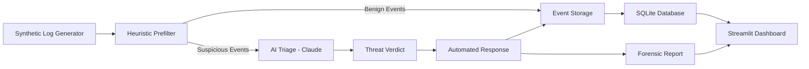

# 🛡️ AI SOC Simulator

An end-to-end **AI-powered Security Operations Center (SOC) simulator** that demonstrates how modern security teams detect, analyze, and respond to cyber threats.

The platform simulates the complete SOC workflow:

**Synthetic Attack Generation → Heuristic Detection → AI Triage → Automated Response → Forensic Reporting**

It is designed for **security education, demonstrations, experimentation, and SOC workflow prototyping** without requiring real-world attacks or network activity.

---

## 1. Problem Statement

Modern Security Operations Centers process a large number of security events generated by systems, applications, networks, and endpoints.

The main challenge is not simply detecting suspicious activity, but determining:

- Which events are genuine threats?
- Which events are false positives?
- How severe is the threat?
- What action should be taken?
- How quickly should the organization respond?

Traditional SOC workflows often involve large volumes of alerts, repetitive investigation, and multiple stages of manual analysis. This can increase **response time, operational cost, and analyst workload**.

For students and beginners, learning these workflows is also difficult because experimenting with real attacks can be unsafe and requires access to complex security infrastructure.

### Problem

There is a need for a **safe, realistic, and interactive environment** that demonstrates how a SOC can detect, investigate, classify, and respond to cyber threats using automation and AI.

---

## 2. Existing Solutions

Existing security platforms such as **SIEM, EDR, XDR, and SOAR systems** can collect security events, detect suspicious activity, correlate alerts, and automate responses.

However, they may present challenges for learning and prototyping:

### Limitations

- **Complexity** — Enterprise security platforms can require significant configuration and cybersecurity expertise.
- **Cost** — Advanced security infrastructure may not be practical for students, small teams, or educational demonstrations.
- **Real-world dependency** — Many environments require real logs, endpoints, or network telemetry for meaningful experimentation.
- **Safety concerns** — Testing real attack and response workflows can create risks when performed on production systems.
- **Limited learning focus** — Users may see the final alert without clearly understanding the complete process from attack generation to automated response.

### Gap

The AI SOC Simulator focuses specifically on making the **entire SOC detection and response pipeline visible, interactive, and safe to experiment with**.

---

## 3. Proposed Solution

We propose an **AI SOC Simulator** that creates realistic synthetic security events and processes them through a complete SOC pipeline.

The system generates both malicious and benign activity, applies low-cost detection rules to identify suspicious events, and then uses AI to perform deeper analysis.

### How it works

1. **Synthetic Log Generation**  
   The simulator generates realistic security events, including brute-force attempts, SQL injection activity, malware C2 traffic, and benign traffic.

2. **Heuristic Prefiltering**  
   Lightweight rules and pattern detection identify potentially suspicious events before sending them to the AI layer.

3. **AI-Powered Triage**  
   Flagged events are analyzed by Claude AI to determine whether they represent a real threat or a false positive.

4. **Automated Response**  
   High-confidence threats are assigned appropriate response actions such as IP blocking or process isolation.

5. **Forensic Reporting**  
   Each incident can generate a structured forensic report containing the event, AI verdict, confidence level, reasoning, and response details.

6. **Live Visualization**  
   A Streamlit dashboard displays the complete process in real time.

The system also supports **Mock Mode**, allowing the complete workflow to be demonstrated without requiring an AI API key.

---

## 4. Key Features

### 🔹 Synthetic Attack Generation
Generates realistic security events without attacking real systems or networks.

Supported scenarios include:

- SSH brute-force attempts
- SQL injection patterns
- Malware C2 beacon activity
- Benign traffic

### 🔹 Heuristic Prefiltering
Uses lightweight rules and pattern matching to quickly identify suspicious events.

Examples:

- 5+ failed logins within a configured time window
- SQL injection patterns
- Suspicious outbound C2 connections

This reduces unnecessary AI/API calls and improves efficiency.

### 🔹 AI Threat Triage
Claude AI analyzes flagged events and determines:

- **Real threat or false positive**
- Threat category
- Confidence score
- Recommended response action
- Reasoning behind the decision

### 🔹 Automated Response
The system can simulate or execute response actions such as:

- Block suspicious IP addresses
- Isolate suspicious processes
- Generate forensic reports
- Store incident information in the database

### 🔹 Mock Mode
The simulator can operate without an API key using simulated AI verdicts.

This makes it suitable for:

- Hackathons
- Classroom demonstrations
- Project presentations
- Offline testing

### 🔹 Live SOC Dashboard
The Streamlit dashboard provides real-time visibility into:

- Total events processed
- Flagged events
- Confirmed threats
- False positives
- Threat categories
- Active IP blocks
- Incident and forensic reports

### 🔹 Safe-by-Default Design
The system runs in **simulated response mode by default**.

Real firewall and process actions are only enabled when explicitly requested using the `--live` option.

---

## 5. Technical Approach

### System Architecture



### Major Components

| Component | Purpose |
|---|---|
| `main.py` | Orchestrates the complete SOC workflow |
| `log_generator.py` | Generates synthetic attack and benign logs |
| `detector.py` | Performs heuristic/rule-based prefiltering |
| `ai_analyzer.py` | Sends flagged events to Claude AI and processes verdicts |
| `responder.py` | Performs or simulates response actions |
| `db.py` | Stores events, verdicts, blocks, and reports in SQLite |
| `dashboard.py` | Provides the live Streamlit visualization |
| `config.py` | Stores configurable thresholds and system settings |

### Data Flow

```text
Synthetic Event
      ↓
Heuristic Detection
      ↓
Suspicious?
   ↙       ↘
 No         Yes
 ↓           ↓
Store      AI Triage
              ↓
       Threat / False Positive
              ↓
        Confidence Check
              ↓
      Automated Response
              ↓
       Forensic Report
              ↓
        SQLite + Dashboard
```

### Detection Methodology

The prefilter uses inexpensive detection logic before AI analysis.

For example:

**Brute Force**

```text
Failed login attempts >= configured threshold
within configured time window
```

**SQL Injection**

```text
Detect suspicious SQL-related patterns
within application/request logs
```

**Malware C2**

```text
Identify suspicious outbound communication
and unusual process/network combinations
```

The AI layer then adds **context-aware analysis** to reduce false positives and prioritize high-confidence threats.

### AI Decision

A flagged event is analyzed using information such as:

- Event category
- Source IP
- Raw log data
- Suspicious behavior patterns
- Context surrounding the event

The AI produces a structured verdict containing:

```text
verdict
confidence
threat_type
reasoning
recommended_action
```

### Response Model

Two response modes are supported:

**Simulated Mode**

- No real system changes
- Actions are logged as simulations
- Recommended for demonstrations and learning

**Live Mode**

- Can execute real firewall rules
- Can send process signals such as `SIGSTOP`
- Intended only for controlled environments such as disposable VMs

### Storage

SQLite is used to maintain:

- Security events
- AI verdicts
- Response actions
- IP block information
- Forensic reports

Forensic reports are generated as structured JSON incident records.

---

## 6. Technology Stack

```text
Programming Language: Python 3.10+

AI / ML:
- Anthropic Claude API
- Heuristic / Rule-Based Detection

Frontend / Dashboard:
- Streamlit

Data Processing:
- Pandas

Database:
- SQLite

Automation / Response:
- Python system operations
- iptables
- Process signals (SIGSTOP)

Reporting:
- JSON-based forensic reports

Deployment:
- Docker
- Docker Compose

Configuration:
- Environment Variables
```

### Infrastructure Requirements

For the basic simulator:

```text
Python 3.10+
pip
SQLite
Streamlit
```

For real AI analysis:

```text
Anthropic API Key
```

For live system response:

```text
Linux environment
Root privileges
iptables
```

---

## 7. Expected Impact

The AI SOC Simulator can provide value to multiple groups.

### 🎓 Students & Learners

Provides a practical way to understand:

- SOC workflows
- Threat detection
- Incident triage
- Security automation
- AI-assisted cybersecurity

without needing a complete enterprise SOC environment.

### 👨‍💻 Developers & Researchers

Creates a controlled environment for:

- Testing detection rules
- Experimenting with AI-based classification
- Evaluating response workflows
- Prototyping cybersecurity automation

### 🏢 Organizations & Teams

Can be used for:

- Security demonstrations
- Internal training
- Incident-response workflow demonstrations
- Proof-of-concept development

### Overall Impact

A successful implementation can make SOC concepts **more accessible, understandable, and safer to experiment with**, while demonstrating how AI can assist security analysts in processing large numbers of security events.

---

## 8. Future Scope

The initial simulator can be extended into a more advanced SOC training and experimentation platform.

### 🚀 Additional Threat Scenarios

Support for:

- Phishing attacks
- Malware execution
- Port scanning
- Privilege escalation
- Data exfiltration
- DDoS-like activity
- Insider threats

### 🧠 Advanced AI Capabilities

Future versions could include:

- Multi-stage attack correlation
- Threat severity scoring
- MITRE ATT&CK mapping
- Natural-language incident investigation
- Automated incident summaries
- Analyst-assistance chat interface

### 🌐 Larger-Scale Deployment

The project could evolve from a local simulator into a hosted platform supporting:

- Multiple users
- Team-based SOC exercises
- Role-based access
- Centralized event collection
- Cloud deployment

### 🔌 Security Tool Integration

Potential integrations include:

- SIEM platforms
- EDR/XDR systems
- Threat intelligence feeds
- Firewall APIs
- Endpoint monitoring tools
- External logging systems

### 📊 Advanced Analytics

Future dashboards could provide:

- Attack timelines
- Detection accuracy
- False-positive rates
- Mean Time to Detect (MTTD)
- Mean Time to Respond (MTTR)
- Detection-rule performance
- AI confidence analysis

---

## 🎯 Project Goal

The ultimate goal of the **AI SOC Simulator** is to demonstrate how a modern SOC can combine **rule-based detection, AI-powered analysis, automation, and visualization** into a single security workflow.

> **Detect → Analyze → Decide → Respond → Learn**

Built for **cybersecurity education, demonstrations, experimentation, and innovation.**
